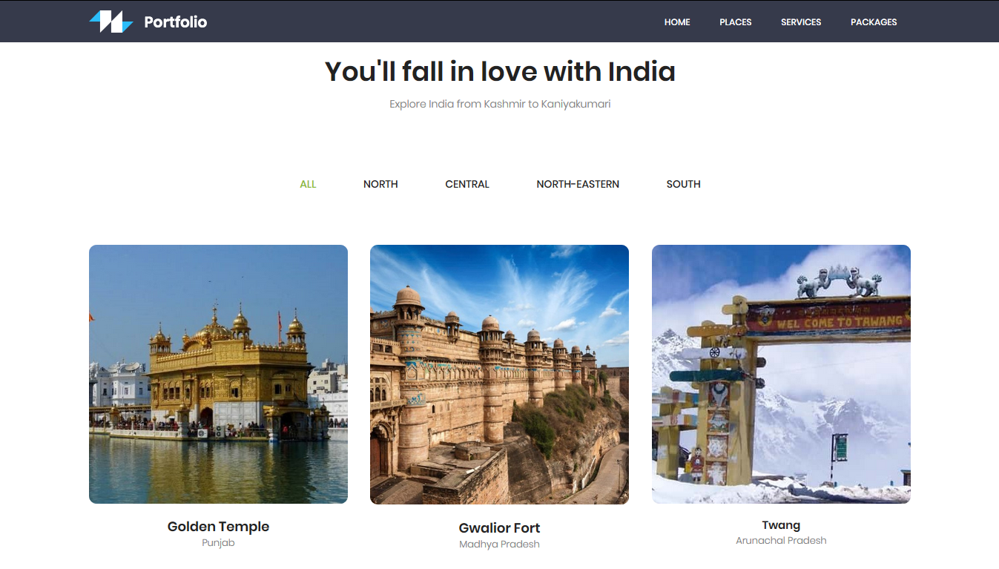
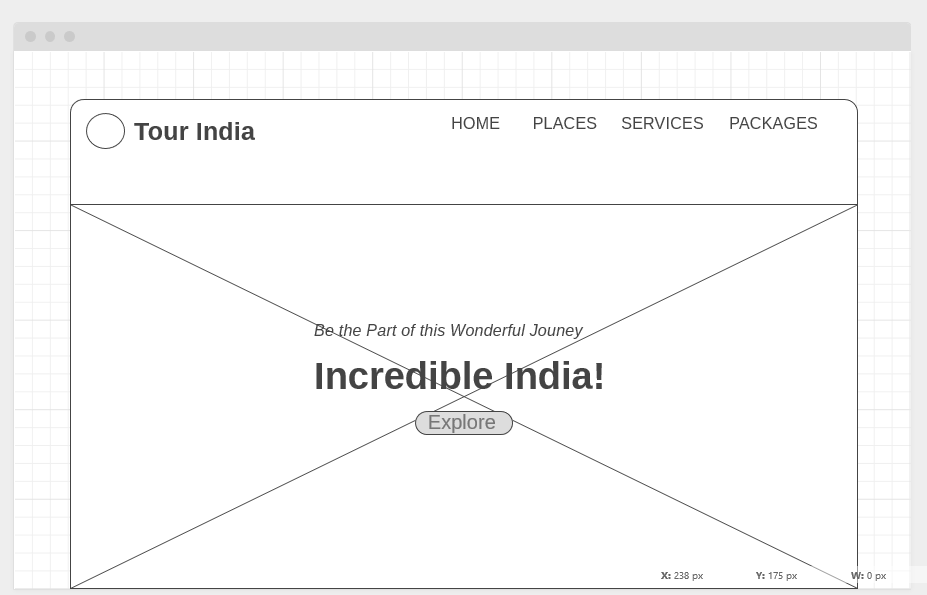

	
	<h4>One page Tourism Website portfolio which shows travel destinations across various part of Country.  This theme made using Bootstrap features several content sections, a responsive portfolio grid (tourist-places), window modals for each portfolio item, and a (NewsLetter) PHP contact form.</h4>

## [Live Preview](https://mrjatinchauhan.github.io/tourindia.github.io/)

## Wireframe

## Usage
After downloading, simply edit the HTML and CSS files included with the template in a code editor to make changes. These are the only files you need to worry about, you can ignore everything else! To preview the changes you make to the code, you can open the `index.html` file in your web browser.
